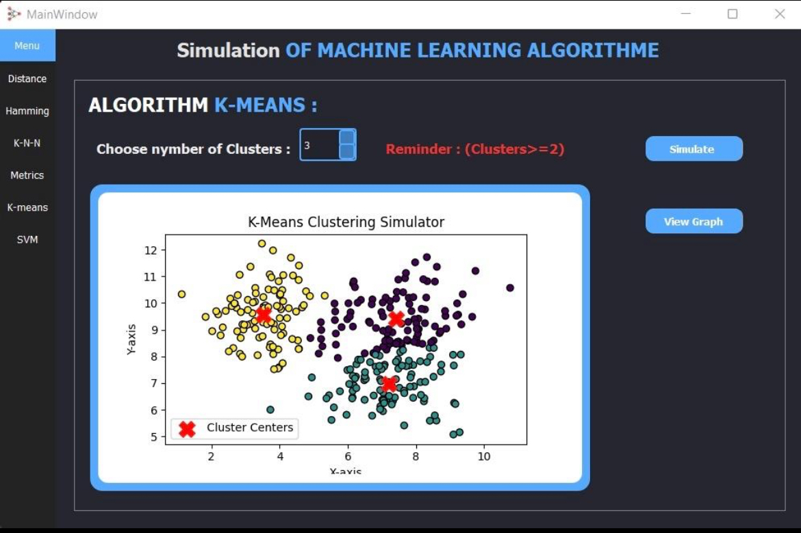
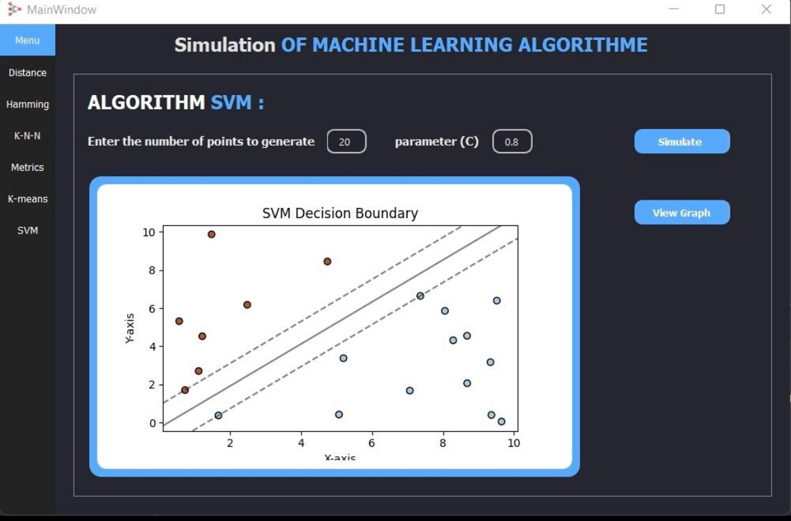

# Machine Learning Algorithm Simulator

## Overview

This project is a simulator designed to visualize and demonstrate various machine learning algorithms. It provides an interactive interface that allows users to understand how different algorithms function, their parameters, and the effects of those parameters on data classification and regression tasks.

## Features

- Visual representation of algorithms in action
- Interactive controls to modify parameters and observe changes
- Support for multiple machine learning algorithms (e.g., decision trees, neural networks, etc.)
- Data generation tools to create synthetic datasets for testing
- Integration with Matplotlib for dynamic plotting

## Installation

To set up the project, clone this repository and install the required dependencies:

```bash
git clone <repository-url>
cd <repository-directory>
pip install -r requirements.txt
```

## Usage

Run the application:

```bash
python main.py
```
Use the GUI to select the machine learning algorithm you wish to simulate.

Adjust the parameters to see how they affect the model's performance.

Observe the results in real-time through visualizations.

## Demonstration




